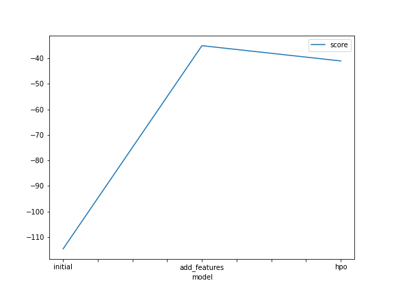
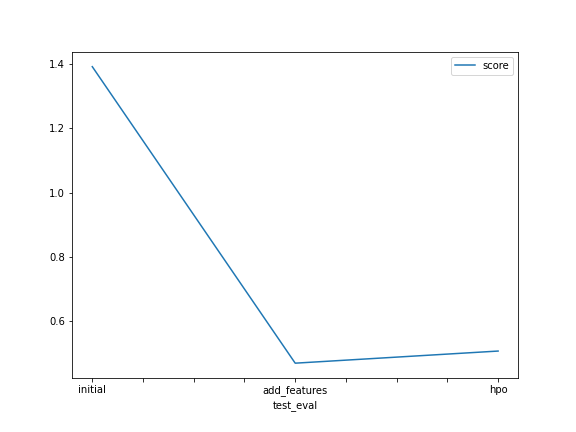

# Report: Predict Bike Sharing Demand with AutoGluon Solution
#### Fady Morris Ebeid

## Initial Training
### What did you realize when you tried to submit your predictions? What changes were needed to the output of the predictor to submit your results?
When I tried to submit my predictions, Kaggle output an error, there were two negative values that needed to be corrected.

### What was the top ranked model that performed?
`WeightedEnsemble_L3` Model, with a RMSE validation score of -114.681259.

## Exploratory data analysis and feature creation
### What did the exploratory analysis find and how did you add additional features?
In exploratory data analysis I extracted the year, month and day from `datetime` column. I also converted `season` and `weather` columns to `categorical` data type.

### How much better did your model preform after adding additional features and why do you think that is?
The model performed significantly better after adding additional features. Separating the `year`, `month` and `day` gave the algorithms extra features to train on.

## Hyper parameter tuning
### How much better did your model preform after trying different hyper parameters?
The model didn't perform better. It performed slightly worse that the previous model.

### If you were given more time with this dataset, where do you think you would spend more time?
I wouls spend more time on feature engineering. I would drop unneccessary features and give more than 10 minutes for autogluon to train.

### Create a table with the models you ran, the hyperparameters modified, and the kaggle score.
|model|NN|GBM|RF|score|
|--|--|--|--|--|
|initial|default|default|default|1.39067|
|add_features|default|default|default|0.47037|
|hpo|NN Tuning|RF Tuning|GBM Tuning|0.50799|

### Create a line plot showing the top model score for the three (or more) training runs during the project.

### Create a line plot showing the top kaggle score for the three (or more) prediction submissions during the project.

TODO: Replace the image below with your own.

## Summary
Machine learning algorihtms performance is improved significanlty with proper _exploratory data analysis_,  _feature engineering_ and giving enough time to train the model.

Model hyperparameter tuning can impact performance score either positively or negatively.
